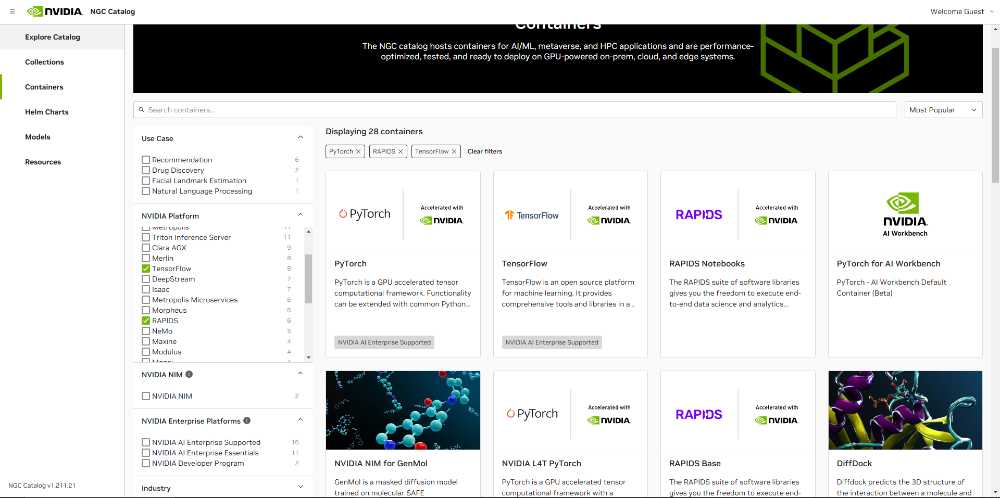

<!-- 
_header: 'Taller GDG'
_footer: 'nonodev96'
-->

# Introducción a la IA con contenedores de alta eficiencia

[@nonodev96/taller-gdg](https://github.com/nonodev96/taller-gdg)

---

## Quien soy


Soy Antonio Mudarra Machuca investigador en la Universidad de Jaén en el grupo de investigación SIMIDAT.

---

## Objetivos del taller

Mostrar las capacidades de **docker** para la ejecución de modelos de IA, simplificando todo el proceso de configuración de distintos entornos de desarrollo y ejecución.

✅ Introducción a docker y contenedores especializados en IA
✅ Configuración de entornos con PyTorch, TensorFlow y herramientas clave
✅ Conocer recursos de nvidia para el desarrollo y despliegue de modelos
✅ Ejecución de modelos LLM en tu propio ordenador con ollama
- Breve introducción a la seguridad en modelos de IA
- Entender y manejar docker, gestionar recursos de un contenedor
- Comprender la diferencia entre imágenes y contenedores
- Conocer otras herramientas como ollama o traefik

---

## Motivación

- Facilidad de despliegue
- Aislamiento de dispositivos individuales
- Ejecución en entornos heterogéneos de controladores/toolkits
- Sólo requiere la instalación del controlador NVIDIA en el host
- Facilita la colaboración: compilaciones reproducibles, rendimiento reproducible, resultados reproducibles

---

## Introducción a docker


---


---

Instalación de docker engine en Ubuntu

- [Install Docker Engine on Ubuntu](https://docs.docker.com/engine/install/ubuntu/)

---

Descarga de los paquetes y actualización de las dependencias

```bash
sudo apt-get update
sudo apt-get install ca-certificates curl
sudo install -m 0755 -d /etc/apt/keyrings
sudo curl -fsSL https://download.docker.com/linux/ubuntu/gpg -o /etc/apt/keyrings/docker.asc
sudo chmod a+r /etc/apt/keyrings/docker.asc

echo \
  "deb [arch=$(dpkg --print-architecture) signed-by=/etc/apt/keyrings/docker.asc] https://download.docker.com/linux/ubuntu \
  $(. /etc/os-release && echo "${UBUNTU_CODENAME:-$VERSION_CODENAME}") stable" | \
  sudo tee /etc/apt/sources.list.d/docker.list > /dev/null

sudo apt-get update
```

---

Instalación de los paquetes de la comunidad en ubuntu

```bash
sudo apt-get install docker-ce docker-ce-cli containerd.io docker-buildx-plugin docker-compose-plugin
```

Ejecución de una imagen para crear un contenedor

```bash
sudo docker run hello-world
```

Modificar los grupos para no necesitar permisos sudo al desplegar los contenedores.

```bash
sudo groupadd docker
sudo usermod -aG docker $USER
newgrp docker          # Activamos los cambios del grupo
docker run hello-world # ya no hace falta ejecutar con permisos sudo
```

---

Si te aparece el siguiente warning es posible que se deba a que has ejecutado un contenedor previamente con permisos de administrador, puedes corregirlo modificando los permisos de la carpeta `~/.docker/`

```
WARNING: Error loading config file: /home/user/.docker/config.json -
stat /home/user/.docker/config.json: permission denied
```

```bash
# eliminas o cambias los permisos
sudo rm -rf /home/"$USER"/.docker

sudo chown "$USER":"$USER" /home/"$USER"/.docker -R
sudo chmod g+rwx "/home/$HOME/.docker" -R
```

---

Instalación de docker desktop en windows, siguiente, siguiente, siguiente.

- [Install Docker Desktop on Windows](https://docs.docker.com/desktop/setup/install/windows-install/)

---


---

## Creación de imágenes con docker

Fichero `Dockerfile` genérico.

```dockerfile
# Definición de la imagen de docker de la que partir
FROM ubuntu:22.04

# Espacio de trabajo donde se iniciará el contenedor una vez creada la imagen
WORKDIR /workspace_nonodev96

# Ejemplo de comando para la creación de la imagen
RUN sudo apt update
RUN sudo apt install screen -y

# Ejemplo de ENTRYPOINT con CMD
ENTRYPOINT ["/bin/echo"] # Por defecto ENTRYPOINT es `/bin/sh -c`
CMD ["hello world!"]
```

---

## NVIDIA CUDA y Librerías

Instalación de CUDA, accedemos a la web para estudiar como instalar el kit de desarrollo de CUDA de nvidia, podemos descargar los drivers desde [CUDA Toolkit 12.8](https://developer.nvidia.com/cuda-downloads)

Para ver todo el listado de productos de nvidia con soporte de CUDA podemos acceder a la web [cuda-gpus](https://developer.nvidia.com/cuda-gpus).

- [CUDA GUIDE WINDOWS](https://docs.nvidia.com/cuda/cuda-installation-guide-microsoft-windows/)
- [CUDA GUIDE LINUX](https://docs.nvidia.com/cuda/cuda-installation-guide-linux/)

---

### Sistemas operativos

Para Windows podemos abrir el panel de dispositivos con `control /name Microsoft.DeviceManager` > `Adaptadores de pantalla`.

Con Debian y derivados podemos ver la gráfica con `lspci | grep VGA` o con el paquete `hwinfo` instalando (`sudo apt install hwinfo`) y comprobando el hardware (`sudo hwinfo --gfxcard`).

```bash
lspci | grep VGA
lspci | grep -i nvidia
sudo apt install hwinfo
sudo hwinfo --gfxcard
```

---

Para ambos casos windows o linux, se instala la orden `nvidia-smi` (NVIDIA System Management Interface).

Este nos permite ver que hardware tiene nuestro equipo y como lo está usando. En la parte superior nos indica la versión máxima soportada por los drivers de nuestra tarjeta, no indica la versión instalada.

```bash
nvidia-smi
nvcc --version # Este es el compilador, no viene con los drivers
```

---

### Sistemas operativos compatibles con el toolkit de CUDA:

- Ubuntu 20.04, **22.04** y 24.04 **⬅️ Recomendado**
- Microsoft Windows 11 24H2, 22H2-SV2 y 23H2
- Microsoft Windows 10 22H2
- Microsoft Windows WSL 2
- Debian 11 y 12
- RHEL / Rocky, KylinOS, Fedora, SLES, OpenSUSE, Amazon Linux, Azure Linux CM2.

---

### Paquetes que incluye

⚠️ Compatibilidad con los distintos sistemas operativos [cuda-toolkit-release-notes](https://docs.nvidia.com/cuda/cuda-toolkit-release-notes/index.html)

- CUDA
  - CUDA Driver
  - CUDA Runtime (cudart)
  - CUDA Math Library (math.h)
  - etc
- cuDNN
  - CUDA Deep Neural Network
- ⚠️ nvidia-container-toolkit (Este no lo incluye 👍 )

---

### Descarga e instalación

---

Descarga e instalación de CUDA para Linux [NVIDIA CUDA Installation Guide for Linux](https://docs.nvidia.com/cuda/cuda-installation-guide-linux/index.html)

Instalación de drivers mediante `ubuntu-drivers` [nvidia-drivers-installation](https://ubuntu.com/server/docs/nvidia-drivers-installation)

---

Ubuntu 24.04

```bash
sudo apt install build-essentials

wget https://developer.download.nvidia.com/compute/cuda/repos/ubuntu2404/x86_64/cuda-ubuntu2404.pin
sudo mv cuda-ubuntu2404.pin /etc/apt/preferences.d/cuda-repository-pin-600
wget https://developer.download.nvidia.com/compute/cuda/12.8.0/local_installers/cuda-repo-ubuntu2404-12-8-local_12.8.0-570.86.10-1_amd64.deb
sudo dpkg -i cuda-repo-ubuntu2404-12-8-local_12.8.0-570.86.10-1_amd64.deb
sudo cp /var/cuda-repo-ubuntu2404-12-8-local/cuda-*-keyring.gpg /usr/share/keyrings/
```

---

WSL 2

```bash
sudo apt install build-essentials

wget https://developer.download.nvidia.com/compute/cuda/repos/wsl-ubuntu/x86_64/cuda-wsl-ubuntu.pin
sudo mv cuda-wsl-ubuntu.pin /etc/apt/preferences.d/cuda-repository-pin-600
wget https://developer.download.nvidia.com/compute/cuda/12.8.0/local_installers/cuda-repo-wsl-ubuntu-12-8-local_12.8.0-1_amd64.deb
sudo dpkg -i cuda-repo-wsl-ubuntu-12-8-local_12.8.0-1_amd64.deb
sudo cp /var/cuda-repo-wsl-ubuntu-12-8-local/cuda-*-keyring.gpg /usr/share/keyrings/
```

---

Tras la actualización de paquetes podemos instalar, instalamos con `apt`, es posible que se requiera un reinicio.

```bash
sudo apt-get update

# Repositorio oficial de nvidia
sudo apt-get -y install cuda-toolkit-12-8

# Repositorio oficial de ubuntu (es más sencillo instalar nvcc en WSL)
sudo apt-get -y install nvidia-cuda-toolkit 
```

---

### Comprobar la instalación

```bash
nvcc --version

ls /usr/local/ | grep cuda
cd /etc/alternatives/cuda 
realpath $(pwd) # Con realpath podéis resolver todos los enlaces simbólicos
```

---

## Instalación del runtime para GPUs de nvidia

Descargar repositorio de `nvidia-container-toolkit` [container-toolkit](https://docs.nvidia.com/datacenter/cloud-native/container-toolkit/latest/install-guide.html)

```bash
curl -fsSL https://nvidia.github.io/libnvidia-container/gpgkey | sudo gpg --dearmor -o /usr/share/keyrings/nvidia-container-toolkit-keyring.gpg \
  && curl -s -L https://nvidia.github.io/libnvidia-container/stable/deb/nvidia-container-toolkit.list | \
    sed 's#deb https://#deb [signed-by=/usr/share/keyrings/nvidia-container-toolkit-keyring.gpg] https://#g' | \
    sudo tee /etc/apt/sources.list.d/nvidia-container-toolkit.list
```

----

```bash
sudo sed -i -e '/experimental/ s/^#//g' /etc/apt/sources.list.d/nvidia-container-toolkit.list
sudo apt-get update
sudo apt-get install -y nvidia-container-toolkit
sudo nvidia-ctk runtime configure --runtime=docker
sudo systemctl restart docker
```

---

Descarga e instalación de CUDA para Windows [CUDA Installation Guide for Microsoft Windows](https://docs.nvidia.com/cuda/cuda-installation-guide-microsoft-windows/)

Siguiente, siguiente, siguiente. (viene con el toolkit)

---

## Docker NVIDIA


---

Ejemplo básico

```bash
docker run --gpus all --rm -ti nvcr.io/nvidia/pytorch:25.01-py3
# Configuración de las Gráficas
docker run --gpus 2 ...
docker run --gpus "device=1,2" ...
docker run --gpus "device=UUID-ABCDEF,1" ...
```

---

## Errores comunes

```bash
docker run --gpus all -it --rm nvcr.io/nvidia/pytorch:25.01-py3
> docker: Error response from daemon: could not select device driver "" with capabilities: [[gpu]].
```

Hay que revisar la instalación del `nvidia-container-toolkit`

---


Puede aparecer esta advertencia "groups: cannot find name for group ID 1000 I have no name!", puedes ignorarla

---

## Docker compose

Despliegue de soluciones con docker compose (orquestación).

```bash
# Obtener más información
docker compose [orden] --help

# Construir los contenedores
docker compose build [servicio]

# Parar los servicios y eliminar los contenedores
docker compose down [servicio]

# Levantar el servicio
docker compose up [servicio] -d # `-d` para segundo plano
```

---

## NVIDIA CATALOG

[Catálogo de contenedores de NVIDIA](https://catalog.ngc.nvidia.com/containers)



---

## Descargar imágenes

```bash
docker pull nvcr.io/nvidia/pytorch:25.01-py3
docker pull nvcr.io/nvidia/tensorflow:25.01-tf2-py3
docker pull nvcr.io/nvidia/rapidsai/notebooks:24.12-cuda12.5-py3.12

docker pull ollama/ollama
docker pull ghcr.io/open-webui/open-webui:main
```

```bash
# https://hub.docker.com/r/nvidia/cuda
docker pull nvidia/cuda:11.8.0-base-ubuntu22.04
```

---

## NVIDIA-Pytorch

```yaml
services:
  runner_pytorch:
    container_name: ${PROJECT_NAME}_runner_pytorch
    image: nvcr.io/nvidia/pytorch:25.01-py3
    # build:
    #   context: ./Apps/runner-pytorch
    #   dockerfile: Dockerfile
    command: bash
    stdin_open: true
    tty: true
    ipc: host # Para compartir memoria
    environment:
      - NVIDIA_VISIBLE_DEVICES=all
      - NVIDIA_DRIVER_CAPABILITIES=all
    volumes:
      - ./Apps/runner-pytorch/workspace_pytorch:/workspace_pytorch
    runtime: nvidia
    deploy:
      resources:
        reservations:
          devices:
            - driver: nvidia
              count: all
              capabilities:
                - gpu
```

---

## NVIDIA-TensorFlow

```yaml
services:
  runner_tensorflow:
    container_name: ${PROJECT_NAME}_runner_tensorflow
    # image: nvcr.io/nvidia/tensorflow:25.01-tf2-py3
    build:
      context: ./Apps/runner-tensorflow
      dockerfile: Dockerfile
    command: bash
    stdin_open: true
    tty: true
    ipc: host
    environment:
      - NVIDIA_VISIBLE_DEVICES=all
      - NVIDIA_DRIVER_CAPABILITIES=all
    volumes:
      - ./Apps/runner-tensorflow/workspace_tensorflow:/workspace_tensorflow
    runtime: nvidia
    deploy:
      resources:
        reservations:
          devices:
            - driver: nvidia
              count: all
              capabilities:
                - gpu
```

---

## NVIDIA-RAPIDSAI

La imagen `rapidsai/base` contiene una shell de `ipython` de manera predeterminada.
La imagen `rapidsai/notebooks` contiene el servidor de `JupyterLab` de manera predeterminada.

```
RAPIDS version
|     CUDA version
|     |        Python version
v     v        v
24.12-cuda12.5-py3.12
```

---


---

```yaml
services:
  runner_rapidsai:
    container_name: ${PROJECT_NAME}_runner_rapidsai-notebook
    image: nvcr.io/nvidia/rapidsai/notebooks:24.12-cuda12.5-py3.12
    #build:
    #  context: ./Apps/runner-3-rapidsai
    #  dockerfile: Dockerfile
    ports:
      - 8888:8888
    stdin_open: true
    tty: true
    ipc: host # Memoria compartida
    environment:
      - NVIDIA_VISIBLE_DEVICES=all
      - NVIDIA_DRIVER_CAPABILITIES=all
      # - EXTRA_CONDA_PACKAGES=jq     # Paquetes extra de conda a instalar
      # - CONDA_TIMEOUT=5             # Espera de 5 segundos tras instalar paquetes de conda.
      # - EXTRA_PIP_PACKAGES=tabulate # Paquetes extra de pip a instalar
      # - PIP_TIMEOUT=5               # Espera de 5 segundos tras instalar paquetes de pip.
    shm_size: "1gb"
    ulimits:
      memlock: -1         # Permitir el bloqueo ilimitado de la memoria
      stack: 67108864     # Tamaño de la pila en bytes
    volumes:
      - ./Apps/runner-3-rapidsai/workspace_rapidsai:/workspace_rapidsai
    runtime: nvidia
    deploy:
      resources:
        reservations:
          devices:
            - driver: nvidia
              count: 1
              capabilities: [gpu]
```

---

## DEV Container


---

## OLLAMA

Ollama es un gestor de modelos LLM que permite descargar, ejecutar y desplegar modelo LLM fácilmente mediante un servidor que distribuye una [API](https://github.com/ollama/ollama/blob/main/docs/api.md).

Esta tecnología nos permite simplificar la distribución de modelos para distintos usos.


---

## Open WebUI

Open-WebUI es una interfaz web de código abierto para interactuar con modelos de inteligencia artificial locales y en la nube. Suelen usarse con modelos LLM como Llama, Mistral o GPT a través de servidores como Ollama o LM Studio.

[@open-webui/open-webui](https://github.com/open-webui/open-webui)

[openwebui.com](https://openwebui.com/)

---


---

### Ejemplo de docker compose de un chat-gpt propio

```yaml
services:
  open-webui:
    image: ghcr.io/open-webui/open-webui:main
    container_name: ${PROJECT_NAME}_open-webui
    restart: unless-stopped
    volumes:
      - local-open-webui:/app/backend/data
    depends_on:
      - ollama
    ports:
      - ${OPEN_WEBUI_PORT-3000}:8080
    environment:
      - "OLLAMA_BASE_URL=http://ollama:11434"
    extra_hosts:
      - host.docker.internal:host-gateway
```

---

```yml
  ollama:
    image: ollama/ollama:latest
    container_name: ${PROJECT_NAME}_ollama
    restart: unless-stopped
    tty: true
    volumes:
      - local-ollama:/root/.ollama
    pull_policy: always
    # GPU support
    runtime: nvidia
    deploy:
      resources:
        reservations:
          devices:
            - driver: nvidia
              count: 1
              capabilities:
                - gpu
volumes:
  local-ollama:
    external: false
  local-open-webui:
    external: false
```

---

## Traefik

Para traefik debemos añadir la redirección al servicio, con ubuntu/debian `sudo nano /etc/hosts` y para Windows abrir el fichero `C:\Windows\System32\drivers\etc\hosts` con el editor de texto dando permisos de administrador y añadir los siguientes DNS.

```bash
# Añadimos el host
127.0.0.1 chat.nonodev96.dev
```

---

## Referencias

- [CUDA Toolkit](https://developer.nvidia.com/cuda-toolkit)
  - [CUDA GUIDE Windows](https://docs.nvidia.com/cuda/cuda-installation-guide-microsoft-windows/)
  - [CUDA GUIDE Linux](https://docs.nvidia.com/cuda/cuda-installation-guide-linux/)
- [NVIDIA Container Toolkit](https://docs.nvidia.com/datacenter/cloud-native/container-toolkit/latest/install-guide.html)
- [Catálogo de contenedores de NVIDIA](https://catalog.ngc.nvidia.com/)
- [VSCODE Extensión Docker](https://marketplace.visualstudio.com/items?itemName=ms-azuretools.vscode-docker)
- [cuDNN](https://developer.nvidia.com/cudnn)
- [cuBLAS](https://developer.nvidia.com/cublas)
- [cuSPARSE](https://developer.nvidia.com/cusparse)
- [OPEN WEB UI](https://docs.openwebui.com/)
- [ollama](https://ollama.com/)
